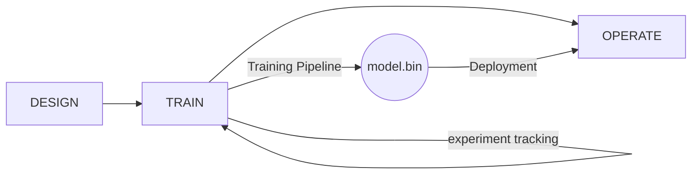
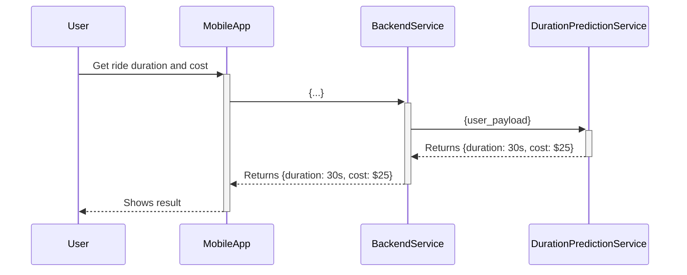
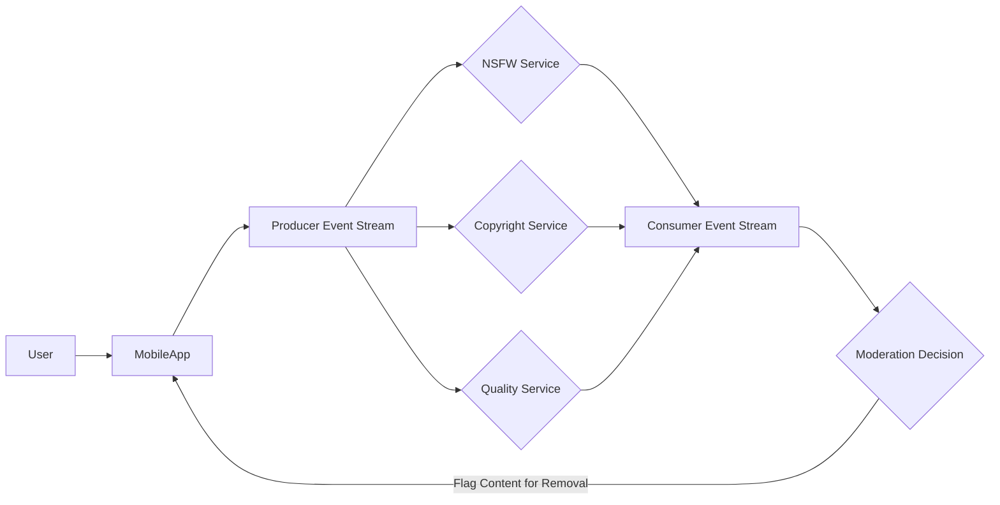

## Week 4 - Model Deployment
### 4.1 Three ways of deploying a model
- Recap of what we've done so far: Design -> Train
- We'll be adding another element in this flow: Design -> Train -> Operate

- There are primarily two kinds of deployments:
    1. Batch (offline) - runs regularly
    2. Online - Up & running all the time with two sub-options:
        1. Web service
        2. Streaming
#### Offline - Batch:
- A batch mode "scores" data based on a pre-trained model on a regular interval (e.g. hourly, daily, monthly)
- This is used for use cases where the activities it supports are not happening in real time but can be batched
    - For example, if I'm sending users promotional offers based on their likelihood to churn from my service, I can easily do this daily
#### Online - Web Service:
- The duration prediction we've been exploring is a perfect use case for a prediction that can be returned by making a call to a "Ride Duration Prediction Service"
- This relationship produces a 1:1 relationship between the client ```(BackendService)``` and the server ```(DurationPredictionService)``` which is kept alive for only as long as it takes to process the request
    - This is an important distinction as it differentiates vs the streaming approach below
- Here's an example of how this could look from a sequence point of view:

#### Online - Streaming
- In the streaming use case, the concept builds on web service by decoupling the client from the server and establishing a many:many relationship between ```Producers``` and ```Consumers```
- Here's an example of what that flow could look like:

- In this flow, the equivalent of the ```BackendService``` is the ```Producer Event Stream```
    - It doesn't establish a connection with the ```Consumers`` or really care what they do with the data its publishing
- That role is fulfilled downstream by a ```Consumer Event Stream``` which feeds its data to a Moderation Decision that decides whether the content should be flagged or not

## 4.2 Deploying Models as a Web-Service
### Some python hygeine notes as we build these apps
- One suggestion that isn't covered in the course is to setup your directory as a python package
- This would enforce some amount of organization and also allow easier access to python functions throughout your work
- Here's a suggested structure for organizing this work:
```bash
|── model_app/
|── __init__.py
├──── ├── src/
│       ├── __init__.py
│       └── predict.py
├──── ├── tests/
│       ├── __init__.py
│       └── test.py
├──── ├── models/
│       └── model1.bin
│       └── model2.bin
```
- Using this structure and by including ```__init__.py``` throughout the package structure indicates each folder should be treated as a package
- Anything in ```__init__.py``` will be executed when a package is imported
#### Building the web service app:
- To deploy a model as a web service, we'll need to do these high-level steps:
    1. Create a virtual environment
    2. Create the script for doing the predictions
    3. Put the script into a Flask App
    4. Package the app to docker
- We'll go through these step by step:
1. Create a virtual environment:
    - There are many ways to do this. Pipenv is a very common way to do this (an alternative would be something like poetry)
    - The way it works is like this:
        - You install package using ```pipenv install <package>```
        - pipenv then adds the package to your Pipfile (a human readable file capturing all the project's depedencies) and creates Pipfile.lock (which contains machine readble content about the dependencies and versions)
2. Create the script for doing the predictions
    - This would be your ```src/predict.py``` file
    - You can accompany it with a ```tests/test.py``` file to call it in order to check it for some candidate inputs
3. Put the script into a Flask app
    - The main parts here are
    - An important call out here is to use a proper WSGI server: ```gunicorn``` to host your prediction service
    - You do this by doing a ```pipenv install gunicorn```
    - And then: ```gunicorn --bind=localhost:9696 predict:app```
        - app is the Flask object instantiated in the predict.py script
4. Package the app to docker
    - To do this, you'll need to make sure to have a few things:
        - Your pipenv artifacts: Pipfile and Pipfile.lock
        - The predict.py where your application code lives and the model binary
    - With that you can create a Dockerfile specifying all these various artifacts and to launch the ```gunicorn``` web server
    - Here's the Dockerfile
        ```docker
        FROM python:3.9.7-slim

        RUN pip install -U pip
        RUN pip install pipenv 

        WORKDIR /app

        COPY [ "Pipfile", "Pipfile.lock", "./" ]

        RUN pipenv install --system --deploy

        COPY [ "predict.py", "model.bin", "./" ]

        EXPOSE 9696

        ENTRYPOINT [ "gunicorn", "--bind=0.0.0.0:9696", "predict:app" ]
        ```
    - Some important call outs:
        - pipenv with --system --deploy skips creating a virtual environment and just install those packages in base python
        - you need to pass 9696 so when a container is deployed, you can access the endpoint
        - the entrypoint is the command to run the gunicorn server with the predict:app flask application
    - Now we can build the docker image with: ```docker build -t name_of_prediction_service:v1 .```
    - And then we can run the docker container with that image: ```docker run -it --rm -p 9696:9696 name_of_prediction_service:v1```